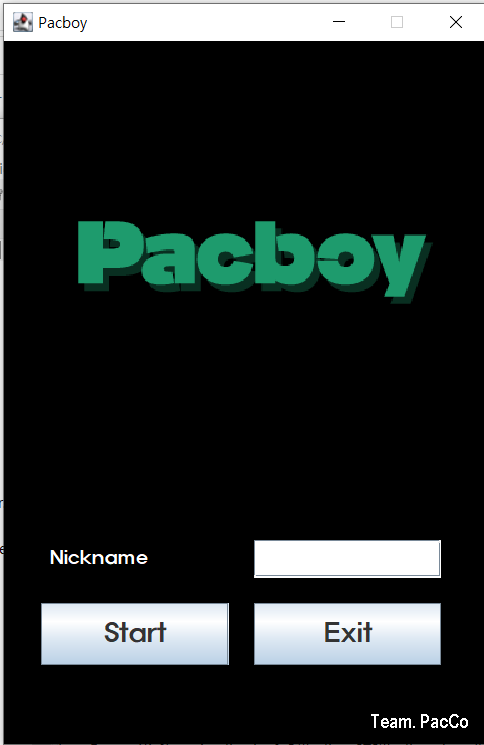
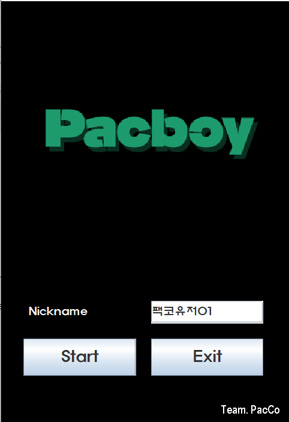
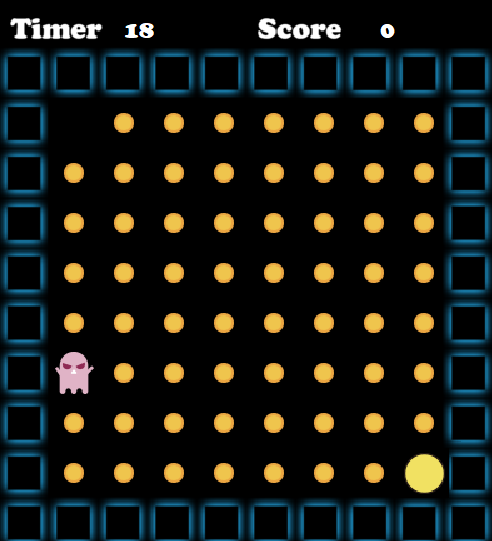
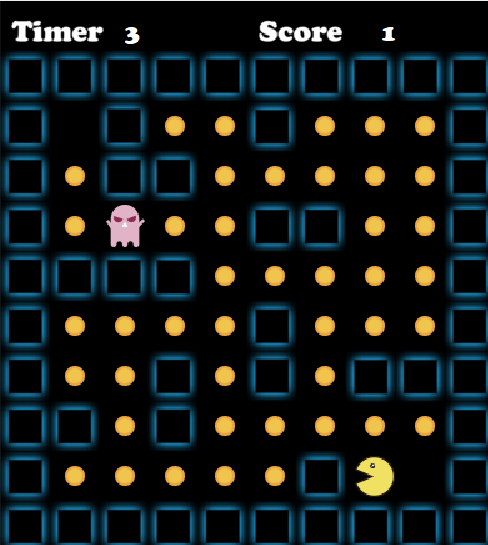
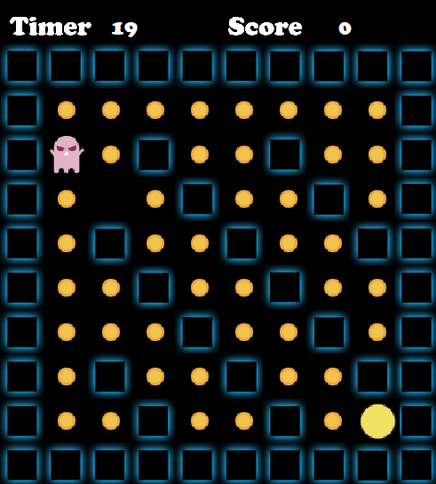
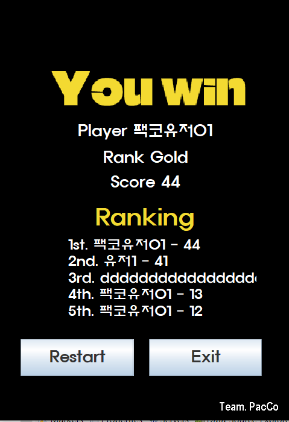
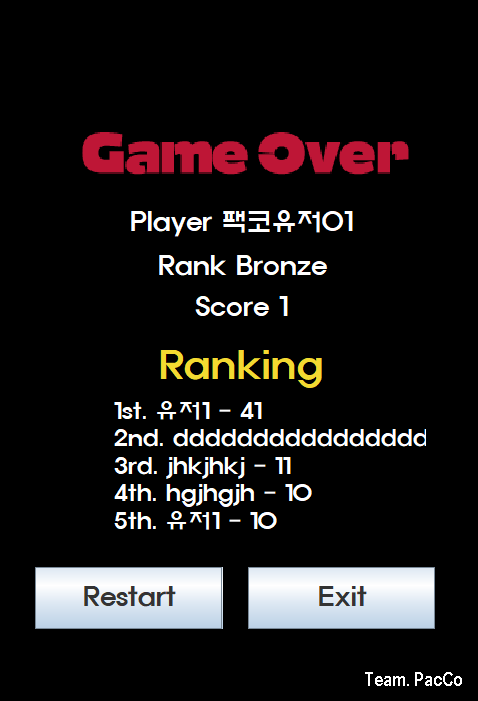

# :sparkles:[ PacBoy(팩보이) ]:sparkles: : Game Project JAVA

> 스레드를 이용한 GUI 게임 구현 / 고전게임 pacman 참고
> 
> 팩보이가 제한시간 안에 유령을 피해 코인을 다먹어야 성공하는 게임

## 개발 기간
- 23.09.13 - 23.09.19 :hourglass_flowing_sand:
  
## 팀원소개 | PacCo(팩코더) :sunglasses::computer:
- 김정림(팀장) : 백엔드 (미로)  [junaa111@nate.com](junaa111@nate.com)
- 김은영 : 프론트엔드 (인트로) [lovekyy1201@naver.com](mailto:lovekyy1201@naver.com)
- 김효범 : 프론트엔드 (아웃트로) [kimkishi97@gmail.com](mailto:kimkishi97@gmail.com)
- 임성균 : 백엔드 (유령) [tjdrbs0607@naver.com](mailto:tjdrbs0607@naver.com)
  
##  개발환경 

    Java      
    JDK SE 11
    IDE : Eclipse 4.26
    Notion / Adobe illustrator / Adobe photoshop
***
:crystal_ball: :grinning: :ghost: - - -  
## 1. 시나리오(개요)

시작화면에 닉네임을 적고 게임 start 버튼을 누른다 // 종료 버튼 으로 종료 가능

게임 난이도는 랜덤으로 시작된다(1,2,3)

팩보이는 키보드 방향키로 조작한다. 유령은 랜덤으로 움직인다

팩보이가 제한시간 안에 코인을 다 먹으면 유저 승리 -> you win 화면으로 넘어감 / 다시 시작 or 종료 가능

팩보이가 제한시간을 넘기거나 / 유령에게 닿으면 유저 패배 -> gameover 화면으로 넘어감 / 다시 시작 or 종료 가능

## 2. 문제분석

- 시작화면
    - 게임 타이틀 (PacMen) 출력
    - 시작버튼, 종료버튼
- 게임순서
    - 시간 30초, 1코인당 1 점
    - 성공 시간안에 다먹기
    - 실패 몬스터에게 닿이기, 시간안에 다못먹기
- 종료화면(성공/실패)
    - 점수
    - 다시시작, 종료
- 추가사항(닉네임 입력 후 랭킹시스템)

## 3. 설계도

- 백그라운드 구현
    - 시작화면(Intro)
    - 종료화면(Outro)
    - 게임화면(Playing)
      
- 컴포넌트 ( 캐릭터/유령/벽/코인/빈벽/ (점수, 타이머) )
    - 미로 클래스 ( 문서에서 바로 읽어드림  가장 먼저 만들어져야함)
    - 타이머 클래스( 시작문구 3,2,1 스타트! , 피버타임 3,2,1 종료!)
      
- 메서드 
    - 버튼 눌렀을때 화면 전환
    - 키보드입력 → 좌버튼 우버튼 상버튼 하버튼 에 맞는 팩맨 이미지변경
  
</img>

## 4. 개발계획

</img>

## 5. 소스코딩

#### pacboy.frame - [상세보기 - WIKI 이동](http://www.naver.com)
- InGameFrame :star:메인메서드:star:
- IntroFrame
- OutroFrame

#### pacboy - [상세보기 - WIKI 이동](http://www.naver.com)
- Coin
- Ghost
- GhostMoveManager
- Pacboy
- PacboyMoveManager
  
#### pacboy.database - [상세보기 - WIKI 이동](http://www.naver.com)
- BGM
- Maze
- Ranking

#### Source File - [상세보기 - WIKI 이동](http://www.naver.com)
- UserInterface

#### Source File - [상세보기 - WIKI 이동](http://www.naver.com)
- C://pacco//resource
  - audio
  - database
  - images

## 6. 포트폴리오 / jar 배포

  </img>
  </img>

  </img>
  </img>
  </img>

  </img>
  </img>

